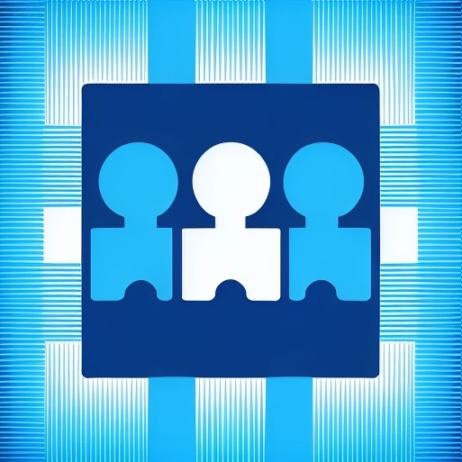

# Godot 4 Multiplayer Bootstrap



## Description

A basic template for Godot 4 involving basic multiplayer for a 3D game.
Features basic functionality where multiple players can connect to a server and move around.
Player positions should be synced, and players will get a name tag based upon their system username.

## Make commands for testing

 - Requires make to be installed.
 - Update GODOT variable in Makefile to match your install location.
 - Run command:

Run game as host:
```
make host
```

Run game as client:
```
make client
```

Run game as dedicated server:
```
make dedicated
```

Export game:
```
make release
```
